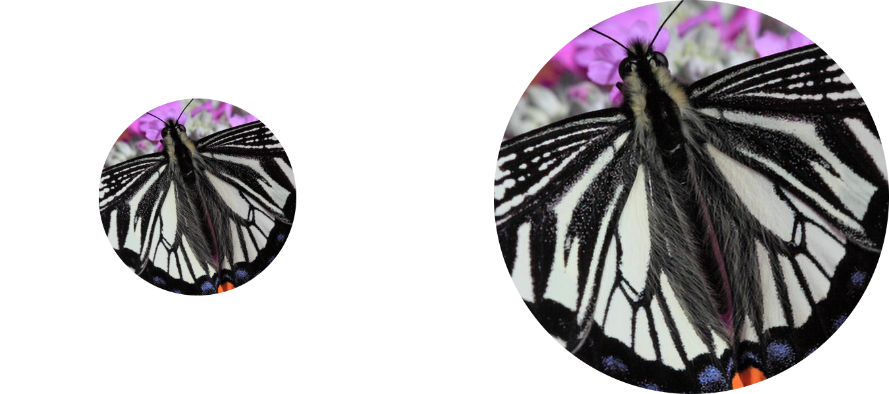
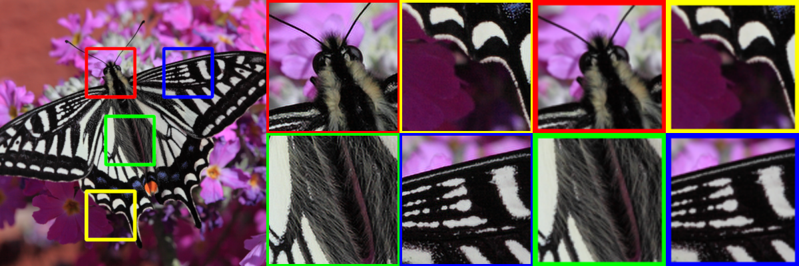
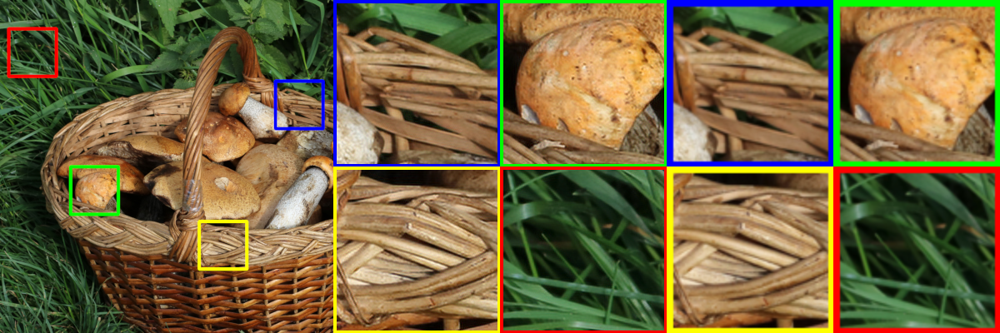
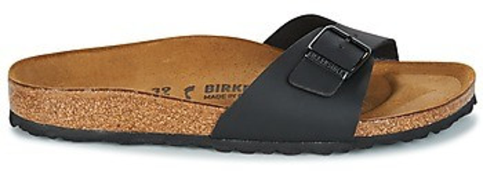
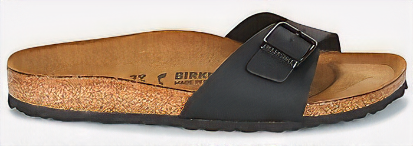
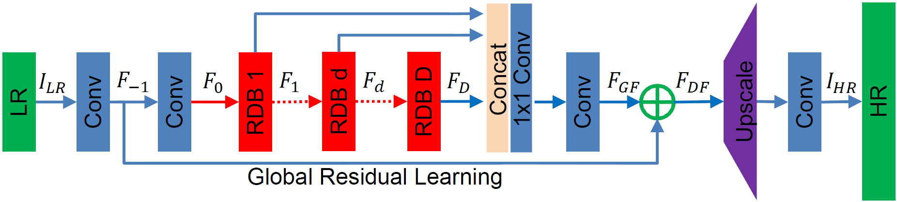

# Image Super-Resolution (ISR)



[](https://travis-ci.org/idealo/image-super-resolution)
[](https://github.com/idealo/image-super-resolution/blob/master/LICENSE)

The goal of this project is to upscale and improve the quality of low resolution images.

This project contains Keras implementations of different Residual Dense Networks for Single Image Super-Resolution (ISR) as well as scripts to train these networks using content and adversarial loss components.  

The implemented networks include:

- The super-scaling Residual Dense Network described in [Residual Dense Network for Image Super-Resolution](https://arxiv.org/abs/1802.08797) (Zhang et al. 2018)
- The super-scaling Residual in Residual Dense Network described in [ESRGAN: Enhanced Super-Resolution Generative Adversarial Networks](https://arxiv.org/abs/1809.00219) (Wang et al. 2018)
- A multi-output version of the Keras VGG19 network for deep features extraction used in the perceptual loss
- A custom discriminator network based on the one described in [Photo-Realistic Single Image Super-Resolution Using a Generative Adversarial Network](https://arxiv.org/abs/1609.04802) (SRGANS, Ledig et al. 2017)

Read the full documentation at: https://idealo.github.io/image-super-resolution/

[Docker scripts](https://idealo.github.io/image-super-resolution/tutorials/docker/) and [Google Colab notebooks](https://github.com/idealo/image-super-resolution/tree/master/notebooks) are available to carry training and prediction. Also, we provide scripts to facilitate training on the cloud with AWS and [nvidia-docker](https://github.com/NVIDIA/nvidia-docker) with only a few commands.

ISR is compatible with Python 3.6 and is distributed under the Apache 2.0 license. We welcome any kind of contribution. If you wish to contribute, please see the [Contribute](#contribute) section.

## Contents
- [Sample Results](#sample-results)
- [Installation](#installation)
- [Usage](#usage)
- [Additional Information](#additional-information)
- [Contribute](#contribute)
- [Citation](#citation)
- [Maintainers](#maintainers)
- [License](#copyright)

## Sample Results

The samples use an upscaling factor of two.
The weights used to produced these images are available under `sample_weights` (see [Additional Information](#additional-information)). They are stored on [git lfs](https://git-lfs.github.com/). If you want to download the weights you need to run `git lfs pull` after cloning the repository.  

The original low resolution image (left), the super scaled output of the network (center) and the result of the baseline scaling obtained with GIMP bicubic scaling (right).

<br>


<br>


Below a comparison of dfferent methods on a noisy image: the baseline, bicubic scaling; the RDN network trained using a pixel-wise content loss; the same network re-trained on a compressed dataset using VGG19-content and adversarial components for the loss. The weights used here are available in this repo.

<p align="center">
<figure>
  
  <figcaption>Bicubic up-scaling (baseline).</figcaption>
</figure>


<figure>
  
  <figcaption>RDN trained with pixel-wise content loss.</figcaption>
</figure>

<figure>
  
  <figcaption>RDN trained with a VGG content and adversarial loss components.</figcaption>
</figure>
</p>

## Installation
There are two ways to install the Image Super-Resolution package:

- Install ISR from PyPI (recommended):
```
pip install ISR
```
- Install ISR from the GitHub source:
```
git clone https://github.com/idealo/image-super-resolution
cd image-super-resolution
python setup.py install
```

## Usage

### Prediction

Load image and prepare it
```python
import numpy as np
from PIL import Image

img = Image.open('data/input/test_images/sample_image.jpg')
lr_img = np.array(img)/255.
lr_img = np.expand_dims(lr_img, axis=0)
```

Load model and run prediction
```python
from ISR.models import RDN

rdn = RDN(arch_params={'C':6, 'D':20, 'G':64, 'G0':64, 'x':2})
rdn.model.load_weights('weights/rdn-C6-D20-G64-G064-x2_enhanced-e219.hdf5')

sr_img = rdn.model.predict(lr_img)[0]
sr_img = sr_img.clip(0, 1) * 255
sr_img = np.uint8(sr_img)
Image.fromarray(sr_img)
```

### Training

Create the models
```python
from ISR.models import RRDN
from ISR.models import Discriminator
from ISR.models import Cut_VGG19

lr_train_patch_size = 40
layers_to_extract = [5, 9]
scale = 2
hr_train_patch_size = lr_train_patch_size * scale

rrdn  = RRDN(arch_params={'C':4, 'D':3, 'G':64, 'G0':64, 'T':10, 'x':scale}, patch_size=lr_train_patch_size)
f_ext = Cut_VGG19(patch_size=hr_train_patch_size, layers_to_extract=layers_to_extract)
discr = Discriminator(patch_size=hr_train_patch_size, kernel_size=3)
```

Create a Trainer object and give it the models
```python
from ISR.train import Trainer

loss_weights = {
  'generator': 0.0,
  'feat_extr': 0.0833,
  'discriminator': 0.01,
}

trainer = Trainer(
    generator=rrdn,
    discriminator=discr,
    feature_extractor=f_ext,
    lr_train_dir='low_res/training/images',
    hr_train_dir='high_res/training/images',
    lr_valid_dir='low_res/validation/images',
    hr_valid_dir='high_res/validation/images',
    loss_weights=loss_weights,
    dataname='image_dataset',
    logs_dir='./logs',
    weights_dir='./weights',
    weights_generator=None,
    weights_discriminator=None,
    n_validation=40,
    lr_decay_frequency=30,
    lr_decay_factor=0.5,
    T=0.01,
)
```

Start training
```python
trainer.train(
    epochs=80,
    steps_per_epoch=500,
    batch_size=16,
)
```

## Additional Information
### RDN Network architecture
The main parameters of the architecture structure are:
- D - number of Residual Dense Blocks (RDB)
- C - number of convolutional layers stacked inside a RDB
- G - number of feature maps of each convolutional layers inside the RDBs
- G0 - number of feature maps for convolutions outside of RDBs and of each RBD output


<br>


source: [Residual Dense Network for Image Super-Resolution](https://arxiv.org/abs/1802.08797)

### RRDN Network architecture
The main parameters of the architecture structure are:
- T - number of Residual in Residual Dense Blocks (RRDB)
- D - number of Residual Dense Blocks (RDB) insider each RRDB
- C - number of convolutional layers stacked inside a RDB
- G - number of feature maps of each convolutional layers inside the RDBs
- G0 - number of feature maps for convolutions outside of RDBs and of each RBD output


<br>


source: [ESRGAN: Enhanced Super-Resolution Generative Adversarial Networks](https://arxiv.org/abs/1809.00219)

### RDN Pre-trained weights
The weights of the RDN network trained on the [DIV2K dataset](https://data.vision.ee.ethz.ch/cvl/DIV2K) are available in ```weights/sample_weights/rdn-C6-D20-G64-G064-x2_div2k-e086.hdf5```. <br>
The model was trained using ```C=6, D=20, G=64, G0=64``` as parameters (see architecture for details) for 86 epochs of 1000 batches of 8 32x32 augmented patches taken from LR images.

The artefact removing and detail enhancing weights obtained with a combination of different training sessions using different datasets and perceptual loss with VGG19 and GAN can be found at `weights/sample_weights/rdn-C6-D20-G64-G064-x2_enhanced-e219.hdf5`

## Contribute
We welcome all kinds of contributions, models trained on different datasets, new model architectures and/or hyperparameters combinations that improve the performance of the currently published model.

Will publish the performances of new models in this repository.

See the [Contribution](CONTRIBUTING.md) guide for more details.

## Citation
Please cite our work in your publications if it helps your research.

```
@misc{cardinale2018isr,
  title={ISR},
  author={Francesco Cardinale et al.},
  year={2018},
  howpublished={\url{https://github.com/idealo/image-super-resolution}},
}
```

## Maintainers
* Francesco Cardinale, github: [cfrancesco](https://github.com/cfrancesco)
* Zubin John, github: [valiantone](https://github.com/valiantone)
* Dat Tran, github: [datitran](https://github.com/datitran)

## Copyright

See [LICENSE](LICENSE) for details.
