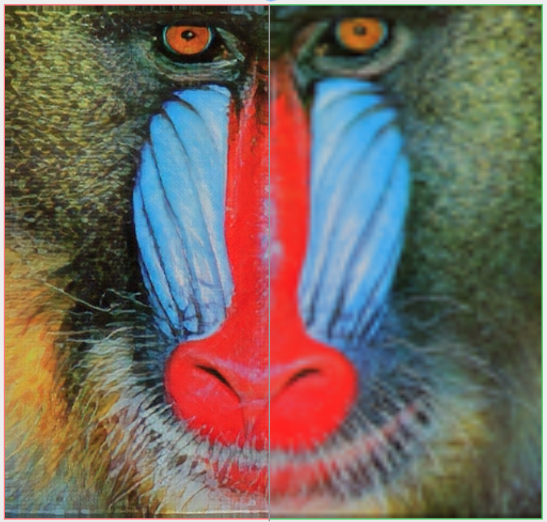
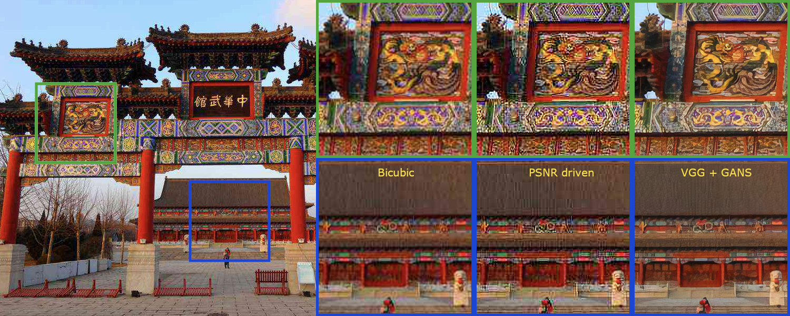
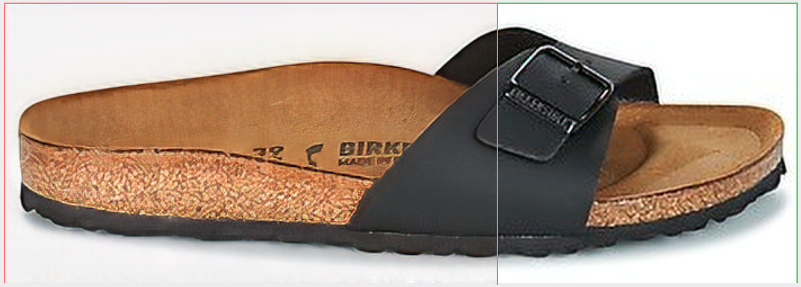

# Image Super-Resolution (ISR)


[](https://travis-ci.org/idealo/image-super-resolution)
[](https://github.com/idealo/image-super-resolution/blob/master/LICENSE)

The goal of this project is to upscale and improve the quality of low resolution images.

This project contains Keras implementations of different Residual Dense Networks for Single Image Super-Resolution (ISR) as well as scripts to train these networks using content and adversarial loss components.  

The implemented networks include:

- The super-scaling Residual Dense Network described in [Residual Dense Network for Image Super-Resolution](https://arxiv.org/abs/1802.08797) (Zhang et al. 2018)
- The super-scaling Residual in Residual Dense Network described in [ESRGAN: Enhanced Super-Resolution Generative Adversarial Networks](https://arxiv.org/abs/1809.00219) (Wang et al. 2018)
- A multi-output version of the Keras VGG19 network for deep features extraction used in the perceptual loss
- A custom discriminator network based on the one described in [Photo-Realistic Single Image Super-Resolution Using a Generative Adversarial Network](https://arxiv.org/abs/1609.04802) (SRGANS, Ledig et al. 2017)

Read the full documentation at: [https://idealo.github.io/image-super-resolution/](https://idealo.github.io/image-super-resolution/).

[Docker scripts](https://idealo.github.io/image-super-resolution/tutorials/docker/) and [Google Colab notebooks](https://github.com/idealo/image-super-resolution/tree/master/notebooks) are available to carry training and prediction. Also, we provide scripts to facilitate training on the cloud with AWS and [nvidia-docker](https://github.com/NVIDIA/nvidia-docker) with only a few commands.

ISR is compatible with Python 3.6 and is distributed under the Apache 2.0 license. We welcome any kind of contribution. If you wish to contribute, please see the [Contribute](#contribute) section.

## Contents
- [Pre-trained networks](#pre-trained-networks)
- [Installation](#installation)
- [Usage](#usage)
- [Additional Information](#additional-information)
- [Contribute](#contribute)
- [Citation](#citation)
- [Maintainers](#maintainers)
- [License](#copyright)

## Pre-trained networks

The weights used to produced these images are available under `sample_weights` (see [Additional Information](#additional-information)).

<b>IMPORTANT</b>: the weights are stored on [git lfs](https://git-lfs.github.com/). To download them either:
- download the raw file (e.g. [here](https://github.com/idealo/image-super-resolution/blob/master/weights/sample_weights/rrdn-C4-D3-G32-G032-T10-x4/Perceptual/rrdn-C4-D3-G32-G032-T10-x4_epoch299.hdf5) -> `Download`);
- clone the repository and run `git lfs pull`.

#### Basic model
RRDN model, PSNR driven, weights [here](weights/sample_weights/rdn-C3-D10-G64-G064-x2/PSNR-driven/).

||
|:--:|
| Low resolution image (left), ISR output (center), bicubic scaling (right). Click to zoom. |
#### GANS model
RRDN model, trained with Adversarial and VGG features losses, weights [here](weights/sample_weights/rrdn-C4-D3-G32-G032-T10-x4/Perceptual/).

||
|:--:|
| RRDN GANS model (left), bicubic upscaling (right). |
-> [more detailed comparison](http://www.framecompare.com/screenshotcomparison/PGZPNNNX)

#### Artefact Cancelling GANS model
RDN model, trained with Adversarial and VGG features losses, weights [here](weights/sample_weights/rdn-C6-D20-G64-G064-x2/ArtefactCancelling/).

||
|:--:|
| Standard vs GANS model. Click to zoom. |


||
|:--:|
| RDN GANS artefact cancelling model (left), RDN standard PSNR driven model (right). |
-> [more detailed comparison](http://www.framecompare.com/screenshotcomparison/2ECCNNNU)


## Installation
There are two ways to install the Image Super-Resolution package:

- Install ISR from PyPI (recommended):
```
pip install ISR
```
- Install ISR from the GitHub source:
```
git clone https://github.com/idealo/image-super-resolution
cd image-super-resolution
git lfs pull
python setup.py install
```

## Usage

### Prediction

Load image and prepare it
```python
import numpy as np
from PIL import Image

img = Image.open('data/input/test_images/sample_image.jpg')
lr_img = np.array(img)
```

Load model and run prediction
```python
from ISR.models import RDN

rdn = RDN(arch_params={'C':6, 'D':20, 'G':64, 'G0':64, 'x':2})
rdn.model.load_weights('weights/sample_weights/rdn-C6-D20-G64-G064-x2/ArtefactCancelling/rdn-C6-D20-G64-G064-x2_ArtefactCancelling_epoch219.hdf5')

sr_img = rdn.predict(lr_img)
Image.fromarray(sr_img)
```

#### Large image inference
To predict on large images and avoid memory allocation errors, use the `by_patch_of_size` option for the predict method, for instance
```
sr_img = model.predict(image, by_patch_of_size=50)
```
Check the documentation of the `ImageModel` class for further details.

### Training

Create the models
```python
from ISR.models import RRDN
from ISR.models import Discriminator
from ISR.models import Cut_VGG19

lr_train_patch_size = 40
layers_to_extract = [5, 9]
scale = 2
hr_train_patch_size = lr_train_patch_size * scale

rrdn  = RRDN(arch_params={'C':4, 'D':3, 'G':64, 'G0':64, 'T':10, 'x':scale}, patch_size=lr_train_patch_size)
f_ext = Cut_VGG19(patch_size=hr_train_patch_size, layers_to_extract=layers_to_extract)
discr = Discriminator(patch_size=hr_train_patch_size, kernel_size=3)
```

Create a Trainer object using the desired settings and give it the models (`f_ext` and `discr` are optional)
```python
from ISR.train import Trainer
loss_weights = {
  'generator': 0.0,
  'feature_extractor': 0.0833,
  'discriminator': 0.01
}
losses = {
  'generator': 'mae',
  'feature_extractor': 'mse',
  'discriminator': 'binary_crossentropy'
}

log_dirs = {'logs': './logs', 'weights': './weights'}

learning_rate = {'initial_value': 0.0004, 'decay_factor': 0.5, 'decay_frequency': 30}

flatness = {'min': 0.0, 'max': 0.15, 'increase': 0.01, 'increase_frequency': 5}

trainer = Trainer(
    generator=rrdn,
    discriminator=discr,
    feature_extractor=f_ext,
    lr_train_dir='low_res/training/images',
    hr_train_dir='high_res/training/images',
    lr_valid_dir='low_res/validation/images',
    hr_valid_dir='high_res/validation/images',
    loss_weights=loss_weights,
    learning_rate=learning_rate,
    flatness=flatness,
    dataname='image_dataset',
    log_dirs=log_dirs,
    weights_generator=None,
    weights_discriminator=None,
    n_validation=40,
)
```

Start training
```python
trainer.train(
    epochs=80,
    steps_per_epoch=500,
    batch_size=16,
    monitored_metrics={'val_PSNR_Y': 'max'}
)
```

## Additional Information
You can read about how we trained these network weights in our Medium posts:
- part 1: [A deep learning based magnifying glass](https://medium.com/idealo-tech-blog/a-deep-learning-based-magnifying-glass-dae1f565c359)
- part 2: [Zoom in... enhance](https://medium.com/idealo-tech-blog/zoom-in-enhance-a-deep-learning-based-magnifying-glass-part-2-c021f98ebede
)

### RDN Pre-trained weights
The weights of the RDN network trained on the [DIV2K dataset](https://data.vision.ee.ethz.ch/cvl/DIV2K) are available in ```weights/sample_weights/rdn-C6-D20-G64-G064-x2/PSNR-driven/rdn-C6-D20-G64-G064-x2_PSNR_epoch086.hdf5```. <br>
The model was trained using ```C=6, D=20, G=64, G0=64``` as parameters (see architecture for details) for 86 epochs of 1000 batches of 8 32x32 augmented patches taken from LR images.

The artefact can cancelling weights obtained with a combination of different training sessions using different datasets and perceptual loss with VGG19 and GAN can be found at `weights/sample_weights/rdn-C6-D20-G64-G064-x2/ArtefactCancelling/rdn-C6-D20-G64-G064-x2_ArtefactCancelling_epoch219.hdf5`
We recommend using these weights only when cancelling compression artefacts is a desirable effect.

### RDN Network architecture
The main parameters of the architecture structure are:
- D - number of Residual Dense Blocks (RDB)
- C - number of convolutional layers stacked inside a RDB
- G - number of feature maps of each convolutional layers inside the RDBs
- G0 - number of feature maps for convolutions outside of RDBs and of each RBD output


<br>


source: [Residual Dense Network for Image Super-Resolution](https://arxiv.org/abs/1802.08797)

### RRDN Network architecture
The main parameters of the architecture structure are:
- T - number of Residual in Residual Dense Blocks (RRDB)
- D - number of Residual Dense Blocks (RDB) insider each RRDB
- C - number of convolutional layers stacked inside a RDB
- G - number of feature maps of each convolutional layers inside the RDBs
- G0 - number of feature maps for convolutions outside of RDBs and of each RBD output


<br>


source: [ESRGAN: Enhanced Super-Resolution Generative Adversarial Networks](https://arxiv.org/abs/1809.00219)

## Contribute
We welcome all kinds of contributions, models trained on different datasets, new model architectures and/or hyperparameters combinations that improve the performance of the currently published model.

Will publish the performances of new models in this repository.

See the [Contribution](CONTRIBUTING.md) guide for more details.

#### Bump version
To bump up the version, use
```
bumpversion {part} setup.py
```

## Citation
Please cite our work in your publications if it helps your research.

```
@misc{cardinale2018isr,
  title={ISR},
  author={Francesco Cardinale et al.},
  year={2018},
  howpublished={\url{https://github.com/idealo/image-super-resolution}},
}
```

## Maintainers
* Francesco Cardinale, github: [cfrancesco](https://github.com/cfrancesco)
* Zubin John, github: [valiantone](https://github.com/valiantone)
* Dat Tran, github: [datitran](https://github.com/datitran)

## Copyright

See [LICENSE](LICENSE) for details.
